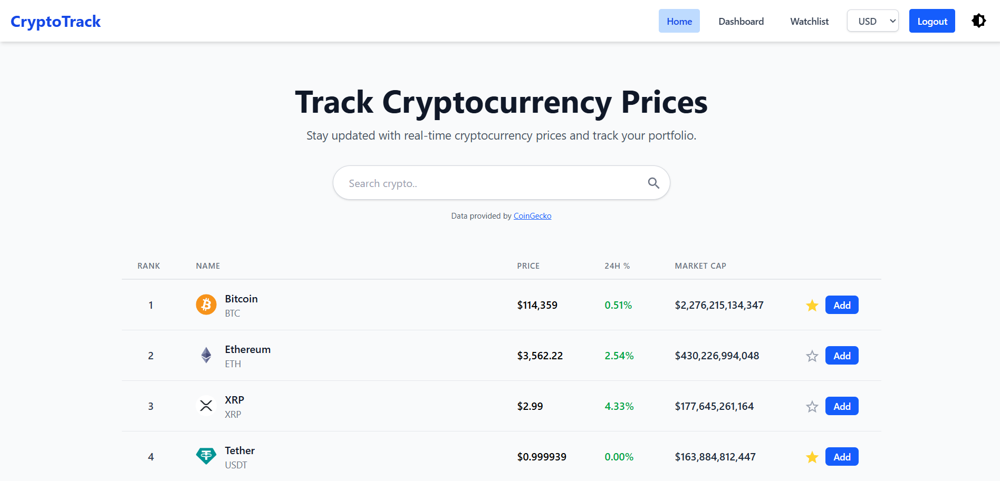
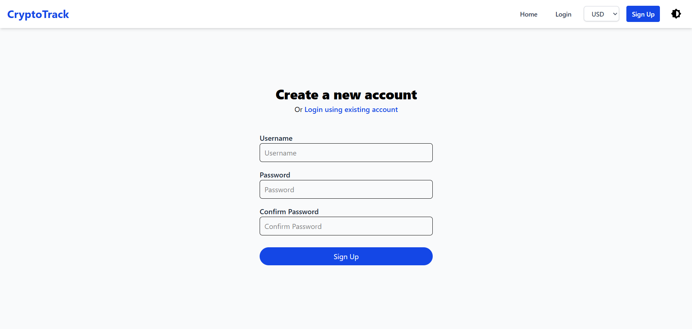

# CryptoTrack

A web application to track real-time cryptocurrency prices, manage a personal portfolio, and maintain a watchlist of favorite coins.

## Table of Contents

-   [Description](#description)
-   [Live Demo](#live-demo)
-   [Features](#features)
-   [Tech Stack](#tech-stack)
-   [Screenshots](#screenshots)
-   [Getting Started](#getting-started)
-   [Attributions](#attributions)
-   [Contact](#contact)

## Description

CryptoTrack is a web application that allows users to track real-time cryptocurrency prices, manage their portfolio, and maintain a watchlist. Users can register, log in, add/remove coins to their portfolio or watchlist, and export their portfolio data as PDF or CSV reports. This project was developed as part of an internship at Ultimez Technology Pvt Ltd.

## Live Demo

The application is deployed and publicly accessible:
-   **Frontend (Vercel):** [`https://cryptotrack-ultimez.vercel.app/`](https://cryptotrack-ultimez.vercel.app/)
-   **Backend (Render):** [`https://cryptotrack-rhun.onrender.com`](https://cryptotrack-rhun.onrender.com)

*Note: The backend is hosted on a free Render instance, so the initial server response might be slow as the instance "wakes up" from a sleep state.*

## Features

-   User authentication (register, login, logout)
-   Real-time cryptocurrency prices (via CoinGecko API)
-   Search cryptocurrency
-   Add/remove coins to portfolio and watchlist
-   Portfolio performance analytics (profit/loss, allocation chart, top gainers, top losers)
-   Export your portfolio report in both PDF and CSV formats.
-   View portfolio values in different fiat currencies (via Frankfurter API)

## Tech Stack

The project is built with the MERN stack and other modern technologies:

-   **Frontend:** React, Tailwind CSS
-   **Backend:** Node.js, Express.js
-   **Database:** MongoDB (with Mongoose)
-   **Authentication:** JWT, Passport.js
-   **APIs:** CoinGecko (crypto data), Frankfurter (currency conversion)
-   **Key Libraries:**
    -   `axios`: For making API requests.
    -   `recharts`: For creating pie chart.
    -   `framer-motion`: For UI animations.
    -   `jspdf` & `jspdf-autotable`: For generating PDF reports.
    -   `React-toastify`: For alerts.

## Screenshots

| Screenshot                           | Description                                                                         |
| ------------------------------------ | ----------------------------------------------------------------------------------- |
|       | **Home Page:** Search and view top cryptocurrencies, add to watchlist or portfolio. |
|     | **Login Page:** Login for registered users.                                         |
|  | **Sign Up Page:** Register a new account.                                           |
|  | **Dashboard:** View portfolio summary, allocation chart, and top gainers/losers.    |
|  | **Watchlist:** Manage your favorite coins.                                          |
|     | **Exported PDF:** Downloadable portfolio report in PDF format.                      |
|     | **Exported CSV:** Downloadable portfolio report in CSV format.                      |

## Getting Started

Follow these instructions to set up and run the project locally on your machine.

### Prerequisites

-   Node.js (v18 or later recommended)
-   Git
-   MongoDB Community Server

### 1. Clone the Repository

```bash
git clone https://github.com/JoyM268/CryptoTrack.git
cd CryptoTrack
```

### 2. Backend Setup

Navigate to the server directory and install dependencies.

```bash
cd Server
npm install
```

#### Setup Local MongoDB

1.  Download and install [MongoDB Community Server](https://www.mongodb.com/try/download/community) if you haven't already.
2.  Start the MongoDB service on your machine. On most systems, you can run `mongod` in a terminal.
3.  The backend will connect to the default local URI.

#### Environment Variables

Create a `.env` file in the `Server` directory and add the following variables.

```env
MONGODB_URI="mongodb://127.0.0.1:27017/cryptotrack"
PORT=3000
CLIENT="http://localhost:5173"
JWT_SECRET="YOUR_JWT_SECRET"
```

#### Run the Backend Server

```bash
npm start
```

### 3. Frontend Setup

In a new terminal, navigate to the client directory and install dependencies.

```bash
# From the root CryptoTrack directory
cd Client
npm install
```

#### Environment Variables

Create a `.env` file in the `Client` directory and add the following:

```env
VITE_API_URL="http://localhost:3000"
```

#### Run the Frontend

```bash
npm run dev
```

The application should now be running at **http://localhost:5173**.


## Attributions

-   Cryptocurrency data provided by [CoinGecko API](https://www.coingecko.com/en/api).
-   Currency conversion powered by [Frankfurter API](https://www.frankfurter.app/).

## Contact

For any questions or suggestions, please reach out to [joy.mascarenhas@outlook.com](mailto:joy.mascarenhas@outlook.com).
