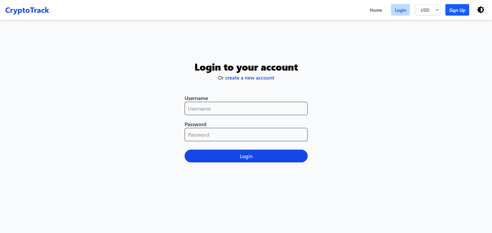
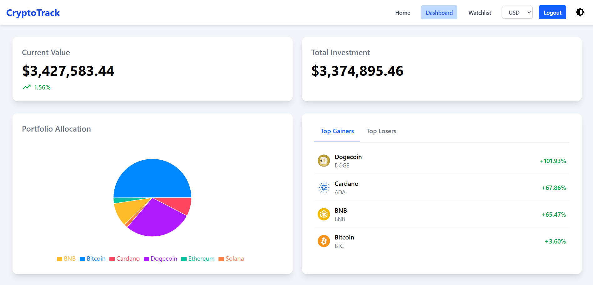
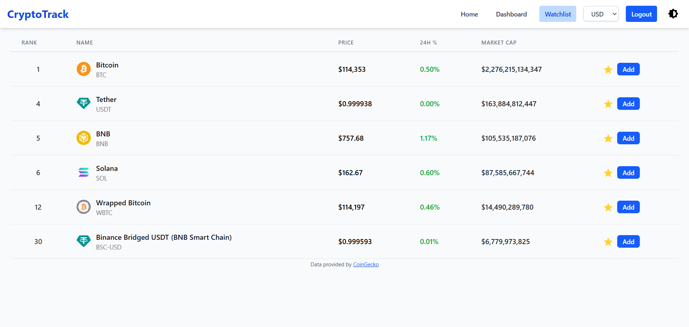

# CryptoTrack

Crypto Currency Price Tracker with Portfolio Manager and Watchlist.


## Table of Contents

-   [Description](#description)
-   [Live Demo](#live-demo)
-   [Screenshots](#screenshots)
-   [Features](#features)
-   [Tech Stack](#tech-stack)
-   [Getting Started](#getting-started)
-   [Contributing](#contributing)
-   [Attributions](#attributions)
-   [Contact](#contact)


## Description

CryptoTrack is a web application that allows users to track real-time cryptocurrency prices, manage their portfolio, and maintain a watchlist. Users can register, log in, add/remove coins to their portfolio or watchlist, and export their portfolio data as PDF or CSV reports. The project was developed as part of an internship at Ultimez Technology Pvt Ltd.


## Live Demo

-   The Frontend is deployed on Vercel.
    https://cryptotrack-ultimez.vercel.app/
-   The Backend is deployed on Render.
    https://cryptotrack-rhun.onrender.com
-   The MongoDB database is hosted on MongoDB Atlas.

You can check out the live demo [here](https://cryptotrack-ultimez.vercel.app/).


## Screenshots

| Screenshot                           | Description                                                                         |
| ------------------------------------ | ----------------------------------------------------------------------------------- |
|       | **Home Page:** Search and view top cryptocurrencies, add to watchlist or portfolio. |
|     | **Login Page:** Login for registered users.                                         |
|  | **Sign Up Page:** Register a new account.                                           |
|  | **Dashboard:** View portfolio summary, allocation chart, and top gainers/losers.    |
|  | **Watchlist:** Manage your favorite coins.                                          |
|     | **Exported PDF:** Downloadable portfolio report in PDF format.                      |
|     | **Exported CSV:** Downloadable portfolio report in CSV format.                      |


## Features

-   User authentication (register, login, logout)
-   Real-time cryptocurrency prices (via CoinGecko API)
-   Search cryptocurrency
-   Add/remove coins to portfolio and watchlist
-   Portfolio performance analytics (profit/loss, allocation chart)
-   Export portfolio as PDF or CSV
-   Currency conversion for portfolio values (via Frankfurter API)


## Tech Stack

-   **Frontend:** HTML, CSS, React, Tailwind CSS
-   **Backend:** Node.js, Express, MongoDB
-   **APIs:** [CoinGecko](https://www.coingecko.com/en/api) (crypto data), [Frankfurter](https://www.frankfurter.app/) (currency conversion)
-   **Deployment:** [Vercel](https://vercel.com/) (Frontend), [Render](https://render.com/) (Backend)
-   **Libraries:** Axios, Recharts, jsPDF, motion, Mongoose, JWT, Passport.js


## Getting Started

1.  **Clone the repository:**

    ```sh
    git clone https://github.com/JoyM268/CryptoTrack.git
    cd CryptoTrack
    ```

2.  **Setup the Backend:**

    ```sh
    cd Server
    npm install
    ```

    -   **Setup MongoDB:**

            - You can [download MongoDB Community Server](https://www.mongodb.com/try/download/community) and install it locally.
            - Add the MongoDB `bin` folder to your system's environment `PATH`.
            - Install [mongosh](https://www.mongodb.com/try/download/shell) (MongoDB Shell) if not already installed.
            - Start the MongoDB server by running `mongosh` in your terminal.
            - Alternatively, you can use [MongoDB Atlas](https://www.mongodb.com/atlas/database) for a free

        <br>

    -   Create a `.env` file in the `Server` directory:
        ```
        MONGODB_URI="mongodb://127.0.0.1:27017/cryptotrack"
        PORT=3000
        CLIENT="http://localhost:5173"
        JWT_SECRET="your_jwt_secret"
        ```
    -   Start the backend server:
        ```sh
        node server.js
        ```

3.  **Setup the Frontend:**

    ```sh
    cd ../Client
    npm install
    ```

    -   Create a `.env` file in the `Client` directory:
        ```
        VITE_API_URL="http://localhost:3000"
        ```
    -   Start the frontend:
        ```sh
        npm run dev
        ```

4.  **Visit the app:**
    -   Open [http://localhost:5173](http://localhost:5173) in your browser.
    

## Contributing

Contributions are welcome! Please submit a pull request or open an issue for any improvements or bug fixes.


## Attributions

-   Cryptocurrency data provided by [CoinGecko API](https://www.coingecko.com/en/api).
-   Currency conversion powered by [Frankfurter API](https://www.frankfurter.app/).


## Contact

For any questions or suggestions, please reach out to [joy.mascarenhas@outlook.com](mailto:joy.mascarenhas@outlook.com).
